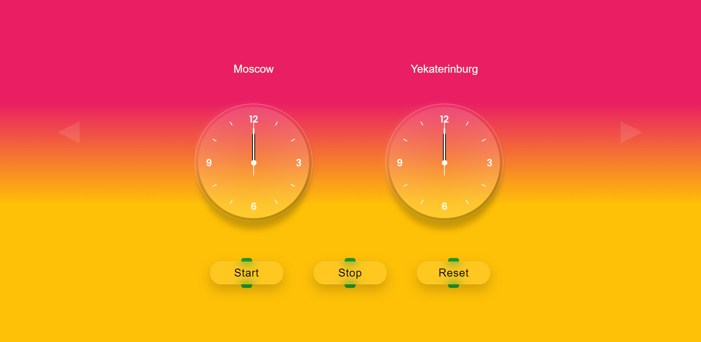

# Городские часы

В данном проекте представлены аналоговые часы показывающие время в 6 разных городах с разными часовыми поясами.

## Цель проекта
1. Закрепление знаний о дате и времени в **JavaScript**.
2. Тренировка в верстке с помощью препроцессора **SASS**.
3. Получение опыта работы с **Gulp**.

## Запуск проекта
### https://artem-suz.github.io/city-clocks-JS/

## Функционал
+ Кнопка **Start** запускает часы. 
+ Кнопка **Stop** останавливает часы.
+ Кнопка **Reset** отключает часы.
+ Боковые кнопки в виде треугольников отвечают за смену городов

## Используемые технологии

* [HTML](https://developer.mozilla.org/ru/docs/Learn/Getting_started_with_the_web/HTML_basics) - язык разметки веб-страницы.
* [SASS](https://sass-scss.ru/documentation/sintaksis/) - препроцессор CSS для описания внешнего вида HTML-документа
* [JS](https://developer.mozilla.org/ru/docs/Learn/JavaScript/First_steps/What_is_JavaScript) - язык программирования позволяющий создать динамичные веб-приложения.
* [Gulp](https://webdesign-master.ru/blog/docs/gulp-documentation.html) - сборщик проекта.

## Вид интерфейса

